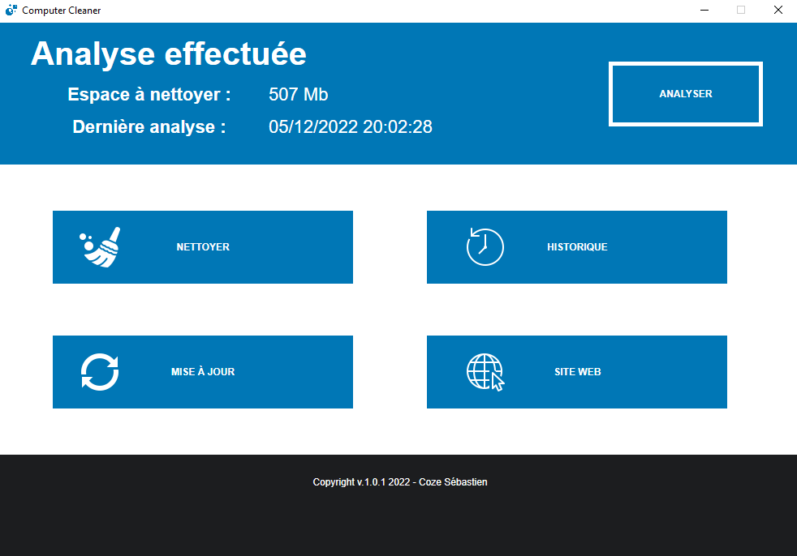

# Computer Cleaner

Computer Cleaner est un logiciel de nettoyage réalisé en `C#` avec le framework `WPF` de `.NET`.

## Installation

[Computer Cleaner - Installer.exe](Installers/Computer%20Cleaner%20-%20Installer%20-%20v.1.0.1.exe) est l'installateur du logiciel. Il a été conçu grâce au script [inno-setup-script.iss](inno-setup-script.iss) et à son [logiciel associé](https://jrsoftware.org/).

### Versions

- [v.1.0.1](Installers/Computer%20Cleaner%20-%20Installer%20-%20v.1.0.1.exe)
    - Modification du lien pour le site.
- [v.1.0.0](Installers/Computer%20Cleaner%20-%20Installer%20-%20v.1.0.0.exe)

## Fonctionnalités

### Analyser

Ce bouton sert à mettre à jour le poids des dossiers possiblements nettoyables. C'est-à-dire :

- Le dossier temporaire pour Windows.
- Le dossier temporaire pour les applications.

En complément à cela, il sauvegarde la date pour pouvoir l'afficher dans le baudeau du haut.

Grâce à cela, l'utilisateur peut savoir à quelle date la dernière analyse a été effectuée.

### Nettoyer

Ce bouton sert à supprimer :

- L'historique des `CTRL` + `C`.
- Le contenu pouvant être supprimé du dossier temporaire de Windows.
- Le contenu pouvant être supprimé du dossier temporaire des applications.

### Mise à jour

Ce bouton sert à informer l'utilisateur si sa version est à jour ou non.

En complément à cela, si ça version n'est pas à jour, un bandeau dans le footer de l'application lui le notifiera.

### Site web

Ce bouton sert à être redirigé vers mon site web.

## Screenshots

Toutes les captures d'écran sont dans le répertoire [screenshots](screenshots/).

### Ouverture du logiciel

### Analyse

### Nettoyage

